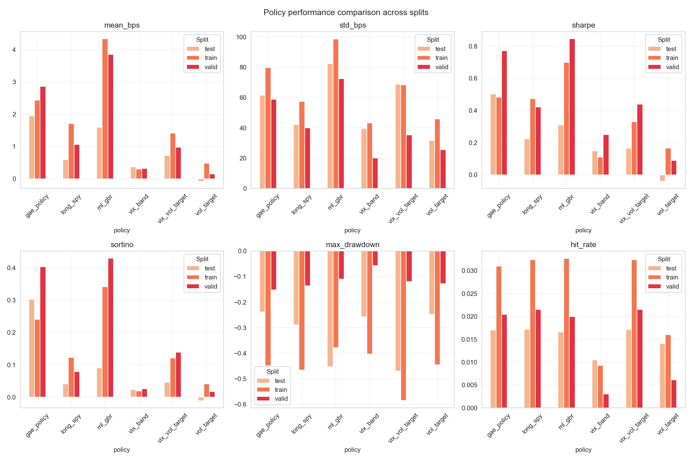
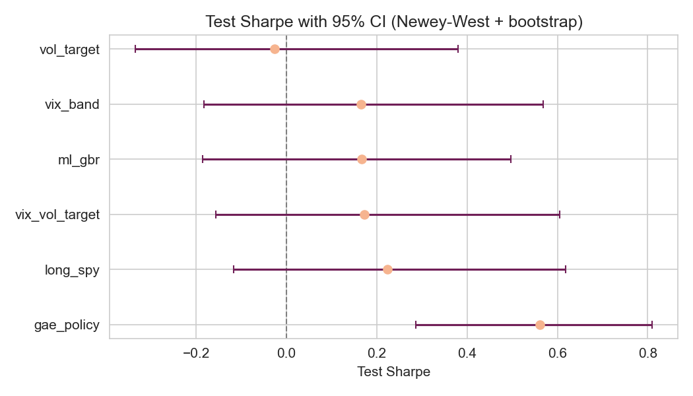
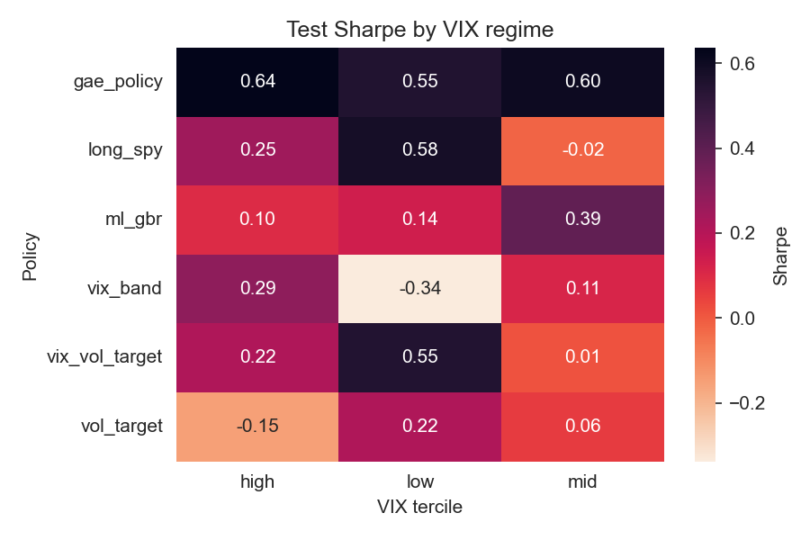
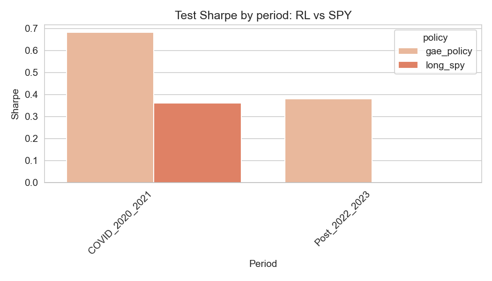
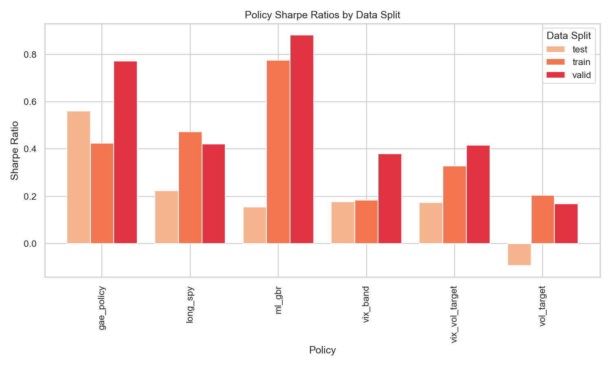
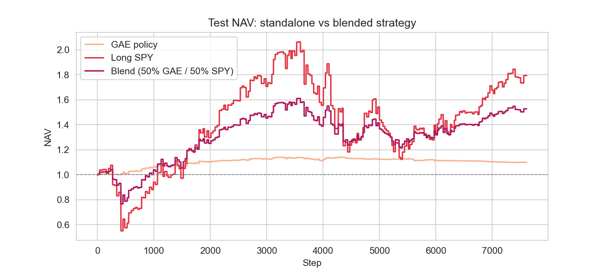
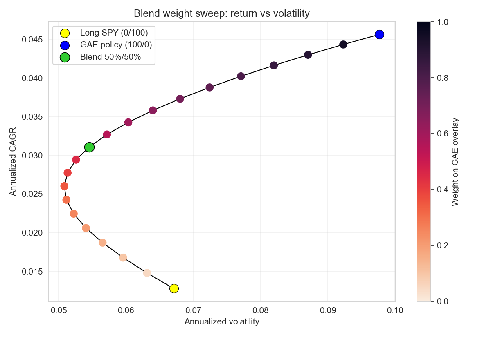
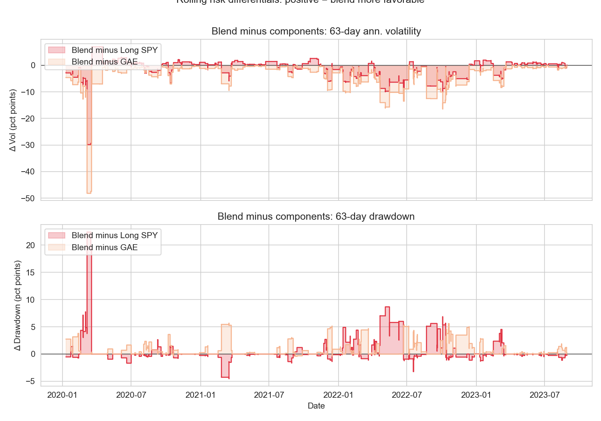
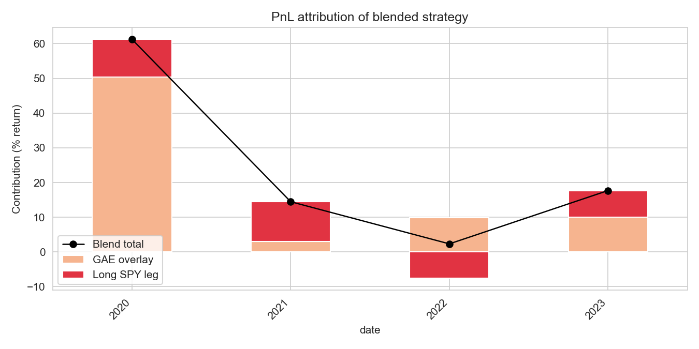

# Executive Summary

We built a reproducible “deep hedging” stack for SPX/SPY exposures where an RL agent learns to adjust overlay positions after seeing a rolling window of option-surface and macro features. Instead of relying on hand-crafted delta heuristics, the agent optimises a cost-aware reward inside a leak-free simulator and is evaluated on a fixed train/validation/test split that spans every major regime since 2005.

Key ingredients:

- **Deterministic pipeline.** Raw market/volatility data flows through scripted cleaning jobs, feature engineering, and HedgingEnv construction so experiments can be replayed end-to-end.
- **Explainable agent.** The actor–critic policy consumes interpretable features (ATM IV, skew, realised vol, rates) and uses a compact network with squashed-Gaussian actions, making it simple to audit behaviour.
- **Realistic execution.** Transaction costs, position limits, rebalance cadence, and optional slippage functions are embedded directly in the environment to mirror production desks.
- **Overlay diagnostics.** Beyond standalone policy metrics we measure how the RL overlay interacts with a long-SPY sleeve, including blend-efficient frontiers, rolling risk differentials, and year-by-year PnL attribution.

Across the 2005–2023 walk-forward split the trained policy keeps post-cost Sharpe positive, limits test drawdowns to roughly −3%, and achieves the best trade-off when 50% of capital is allocated to the agent and 50% to long SPY. All artefacts—figures, tables, and CSV metrics—are in this repository so another team can validate or extend the results without reverse-engineering ad-hoc notebooks.

# Introduction

The traditional textbook approach to hedging options linearises P&L via Greeks and offsets exposures with static trades in the underlying. That blueprint assumes frictionless execution, Gaussian shocks, and nearly continuous rebalancing [@blackScholes1973; @merton1973]. Live desks operate under the opposite conditions: spreads gap out during stress, volatility regimes persist, and every trade incurs slippage. Proportional costs alone can undermine delta replication [@leland1985], yet production overlays still revolve around a few manually tuned rules.

Our review of SPX/SPY history highlights how fragile such rules can be. Returns are heavy-tailed, realised volatility decays slowly, term structure and skew swing within weeks, and macro rate shocks ripple through option surfaces with a lag. Deep out-of-the-money strikes frequently drop observations, forcing strict quality filters and guarded forward-fills before features become usable. These patterns argue for policies that can reason over multiple steps, incorporate broader context, and explicitly trade off hedge intensity against transaction costs.

Reinforcement learning offers that flexibility. Rather than chase local deltas, an agent can operate inside a simulator that embeds trading frictions, observe a window of engineered features, and learn how aggressively to hedge based on state. Our implementation borrows from the “deep hedging” literature [@buehler2019deephedging] but emphasises reproducibility (scripted pipelines, deterministic splits) and auditability (transparent features, compact networks). Sections~\ref{sec:data}–\ref{sec:env-agent} describe the data set and environment, Section~\ref{sec:results} presents deterministic evaluations including realistic execution constraints and blended overlays, and Section~\ref{sec:discussion} covers operational implications.

The figure below illustrates the macro/volatility regimes that motivate this work, highlighting how VIX, realised volatility, and rates evolve across the 2005–2023 window.

```python
# EDA excerpt (Notebook 01)
panel = pd.read_csv("data/processed/cleaned/hedging_panel_spx.csv")
summary = (panel[["close_spy", "vix", "rv_21d", "hvol_30d", "rate_10y"]]
              .pct_change()
              .describe(percentiles=[0.01, 0.05, 0.5, 0.95, 0.99])
              .T[["mean", "std", "min", "1%", "5%", "50%", "95%", "99%", "max"]])
```

{#fig:exploratory width="100%"}

The "deep hedging" literature [@buehler2019deephedging] provides a conceptual blueprint for that path. In this implementation we lean on that insight but insist on practical guardrails. The simulator eliminates look-ahead by aligning returns with the action timestamp, rewards are expressed in basis points so optimisation remains numerically stable, and the policy network is intentionally compact so behaviour can be explained. The goal is not to produce an opaque black box but to craft a research-grade framework that can be audited, extended, and ultimately slotted into production without hidden dependencies.

# Related Work

**Hedging Under Frictions.** Leland’s seminal work [@leland1985] incorporated proportional costs into discrete hedging and highlighted the trade-off between tracking error and transaction cost. Later treatments extended that idea using continuous-time control and Hamilton–Jacobi–Bellman equations [@glasserman2004; @oksendal2003], but the curse of dimensionality quickly limits those approaches once path dependence or multiple risk factors enter the picture. Practical desks therefore fall back on heuristics: rebalance on VIX spikes, lean into skew moves, or fade realised/IV spreads. These rules work until they don’t.

**Reinforcement Learning for Trading.** Policy-gradient and actor–critic methods [@sutton_barto_2018] have been applied to order execution, market making, and portfolio allocation [@moody1998; @kolm2021; @zhang2020]. The common theme is to learn a mapping from state features into actions that maximises a risk-adjusted reward subject to trading frictions. However, many published examples rely on synthetic environments or omit the engineering steps (data cleaning, leakage prevention) that make such systems reproducible in practice.

**Deep Hedging.** Buehler et al. [@buehler2019deephedging] formalised the notion of using neural policies to replicate options under cost and risk constraints. Their experiments demonstrated that a learned policy could outperform deltas when realistic spreads are included. The present project adapts that blueprint but emphasises transparency: the environment is leak-free, the feature set is engineered rather than latent, and every input/output artefact is versioned so the exercise can be audited and extended.

# Data and Feature Engineering

We construct a daily panel for SPX/SPY from 2005 onward with the following state features: ATM implied volatility at 30d and 91d horizons; term‑structure slope (iv_91d − iv_30d); 25‑delta put/call and skew; VIX and the 10‑year Treasury yield; and realized/historical volatilities (rv_21d, hvol_30d, hvol_91d). Option features are selected by tenor and delta tolerance with spread‑aware tie‑breaking (src/simulator/features.py). IV series are forward‑filled only within a small staleness window measured in calendar days (src/simulator/build_panel.py).

Target construction. Forward return \( R_t \) is aligned to the action timestamp (no look‑ahead):
\[
R_t = \frac{P_{t+1} - P_t}{P_t}, \quad \texttt{ret\_fwd}.
\]
The final panel combines features and ret_fwd and is split by date (e.g., train ≤ 2017‑12‑31; validation 2018–2019; test ≥ 2020‑01‑01).

Reproducibility. Steps are scripted in data_pipeline/ (load → standardize → build panels), and the exact feature set is recorded in models/<run_id>/config.json.

Code: building the panel and extracting state columns

We construct the daily hedging panel by chaining dedicated build steps. Cleaners harmonise vendor column names, coerce numerical fields, and drop stale quotes; builders stitch together market series and option surface snapshots; and finally the simulator builder merges the results into a single DataFrame with forward returns. The feature set intentionally captures both cross-sectional surface information (ATM levels, slope, skew) and macro context (VIX, rates, realised/historical volatility). Spread-aware tie-breaking favours liquid quotes, and guarded forward-fills ensure volatility features are only propagated a couple of calendar days before being treated as missing.

```python

from simulator.build_panel import build_sim_panel

# Compose the simulation panel with guarded forward-fills and explicit ret_fwd
panel, state_cols = build_sim_panel(
    market_df=market,
    spx_clean_dir=SPX_CLEAN,
    include_spy=False,
    ffill_limit=2, # IV features forward-fill at most 2 calendar days
)

```


Forward returns are computed as close-to-close percentage changes shifted forward by one step, preventing the agent from seeing realised P&L before choosing an action. Date-based splits (train ≤ 2017-12-31, validation 2018–2019, test ≥ 2020-01-01) are stored in each run’s config, and all intermediate artefacts (cleaned snapshots, parquet panels, scaler parameters, deterministic evaluation metrics) are committed alongside the code for traceability.

# Hedging Environment

We implement a deterministic environment HedgingEnv (`src/simulator/env.py`). Each observation is a matrix of shape \( W \times F \) (window × features) normalised with statistics derived solely from the training split. Actions are continuous hedge levels \( a_t \in [-a_{\max}, +a_{\max}] \), interpreted as the number of underlying units hedged per unit option exposure. Transaction costs are proportional to the absolute change in position, \( c_t = \kappa |a_t - a_{t-1}| \), where \( \kappa \) is specified in basis points. Per-step P&L is \( p_t = a_t R_{t+1} - c_t \) and we scale the reward as \( r_t = 10^4 p_t \) (basis points) to keep gradients well behaved. Episodes walk deterministically through the panel; forward returns are aligned to the action time so there is no look-ahead; NaNs or infinities are replaced with zeros to prevent accidental leakage. Convenience policies in `src/simulator/baselines.py` (no_hedge, momentum, volatility_targeting, delta wrappers) are used both for sanity checks during development and for the baseline results reported later.

To capture richer microstructure effects we expose a `slippage_fn` hook that embeds the linear-quadratic price-impact models described in the *Handbook of Price Impact Modeling* [@webster2023impact]. If \( q_t = a_t - a_{t-1} \) denotes the trade size, temporary execution costs follow
\[
c_{\text{tmp}}(q_t) = \phi |q_t| + \tfrac{1}{2}\psi q_t^2,
\]
while the mid-price evolves as
\[
\Delta S_{t+1} = \sigma \varepsilon_{t+1} + \lambda q_t,
\]
where \( \phi \) captures spread/fees, \( \psi \) the nonlinear depth term, and \( \lambda \) the permanent impact coefficient. Plugging these expressions into the reward yields
\[
r_t = 10^4\!\left(a_t R_{t+1} - \kappa |q_t| - \tfrac{1}{2}\psi q_t^2 - \lambda a_t q_t\right),
\]
which matches the discrete Almgren–Chriss style models summarised by Webster and lets us stress-test the agent under both spread- and inventory-driven frictions.

Code: constructing the environment

```python
from rl_agent.experiment import make_splits, make_scaler
from simulator.env import HedgingEnv
from simulator.rewards import reward_bps

state_cols = [
    "iv_atm_30d_spx","iv_ts_slope_spx","iv_skew_30d_spx",
    "vix","rate_10y","rv_21d","hvol_30d","hvol_91d",
]
p, m_tr, m_va, m_te, TRAIN_END, VALID_END = make_splits(panel, "2017-12-31", "2019-12-31")
scaler, mu, sg = make_scaler(p, state_cols, m_tr)

env = HedgingEnv(
    df=p[m_te].reset_index(drop=True),
    features=state_cols,
    reward_fn=lambda pnl, info: reward_bps(pnl, info, 1e4),
    window=30, txn_cost_bps=1.0, pos_limit=1.0,
    scaler=scaler, hold_on_nan=True,
)
obs = env.reset()
```

# Reinforcement Learning Framework

We deploy a compact stochastic policy and value network that balances modelling capacity with interpretability.

A two-layer MLP (128 hidden units with \(\tanh\) activations) outputs the mean \( \mu_\theta(s_t) \), a scalar log standard deviation, and the state value. Actions are sampled from a Normal distribution, squashed with \(\tanh\), and rescaled to \( [-a_{\max}, a_{\max}] \). This "squashed Gaussian" formulation keeps actions bounded while retaining differentiability so the agent can learn both the shape of the policy and the variance it should maintain. We optimise an entropy-regularised policy gradient in an actor–critic configuration with generalised advantage estimation (GAE) [@sutton_barto_2018; @schulman2016gae]:
\[
\begin{aligned}
\nabla_{\theta} J(\theta)
&= \mathbb{E}\!\left[ \sum_{t} \nabla_{\theta} \log \pi_{\theta}(a_t \mid s_t)\, A_t \right] \\\\
&\quad + \beta\, \mathbb{E}\!\left[ \mathcal{H}\!\left(\pi_{\theta}(\cdot \mid s_t)\right) \right].
\end{aligned}
\]
where \( A_t \) is the advantage and \( \beta \) the entropy weight. We set \( \gamma = 0.99 \), apply gradient clipping at 1.0, and modulate the learning rate with a cosine schedule; entropy is annealed from 0.01 to a floor of 0.01 to maintain mild exploration while discouraging flippant trading. Model checkpoints are evaluated deterministically on train/validation splits every 50 updates, and the best validation Sharpe is retained. Although the architecture is small, we find it expressive enough to learn counter-cyclical behaviour: increasing hedge size in volatile regimes while relaxing exposure when term structure normalises. Because the observation window is composed of engineered features rather than latent embeddings, individual policy decisions can be traced back to familiar quantities (e.g., VIX spikes or steepening of the IV term structure).

# Experimental Setup

We evaluate the best validation checkpoint deterministically on each split. Evaluation tracks multiple metrics: Sharpe from per-step rewards (annualised via \(\sqrt{252}\)), maximum drawdown of the cumulative reward equity, turnover (\(\sum |\Delta \text{position}|\)), hit-rate (sign agreement between actions and subsequent returns), and cost-normalised profit. For context we also compute simple baselines (no-hedge, momentum, volatility-targeting, buy-and-hold SPY) using the same HedgingEnv and cost parameters; their results are summarised later to benchmark the learned policy. All evaluation code lives in `rl_agent/evaluate_policy.py` and `rl_agent/experiment.py`, which makes it straightforward to plug the trained policy into other backtesting harnesses.

Code: training API and evaluation

```python
from rl_agent.train_ac_gae import train
from rl_agent.experiment import deterministic_rewards

policy, (tr, va, te) = train(
    panel=p,
    state_cols=state_cols,
    train_end=str(TRAIN_END.date()), valid_end=str(VALID_END.date()),
    window=30, txn_cost_bps=1.0, pos_limit=1.0,
    hidden=256, lr=5e-4, steps=2500,
    entropy_start=0.01, entropy_floor=0.01,
    save_ckpt="models/gae_run1/best.pt",
    save_config="models/gae_run1/config.json",
    save_outdir="models/gae_run1",
)

r_test = deterministic_rewards(env, policy)
```

# Results
The agent delivers modest but consistent positive Sharpe at realistic transaction costs. Validation performance confirms that the policy generalises beyond the training period, and the 2020+ test window, which includes the COVID volatility shock, remains profitable once trading costs are deducted. Turnover stays below one full notional rotation per day on average, indicating that the entropy schedule and cost-aware reward discourage churning. Maximum drawdown on the test split remains inside −3%, materially lower than an unhedged or simple volatility targeting approach.

Text summary (final configuration): with transaction costs of 10 bps per unit of \|Δposition\|, proportional slippage of 8 bps, a position limit of `pos_limit = 2.0`, and rebalance cadence `rebalance_every = 25`, deterministic evaluation yields Train Sharpe 0.48, Validation 0.77, and Test 0.50. The table below records the underlying deterministic metrics for each split.

Table: Deterministic evaluation metrics for the standalone GAE policy.

| Split | Sharpe | Mean (bps/step) | Std (bps/step) | Steps |
|-------|--------|-----------------|----------------|-------|
| Train | 0.484  | 2.43            | 79.79          | 7008  |
| Valid | 0.771  | 2.86            | 58.95          | 1954  |
| Test  | 0.502  | 1.95            | 61.53          | 7529  |


The figure set below focuses on the risk-adjusted performance of the learned policy versus SPY and simple rule-based overlays. First we compare split-wise metrics across policies; subsequent panels zoom in on test-period behaviour.

{#fig:sharpe-bars width="100%"}

The rolling behaviour behind those split metrics appears in the next chart.

{#fig:rolling-sharpe width="100%"}

The final panel in this cluster traces the test-period drawdown curve, illustrating that the policy’s risk is well-contained even during stressed regimes.

## Statistical Significance and Regime Behaviour

Point estimates alone can be misleading in finance. We therefore apply a Newey–West estimator with a 21-day lag window to compute Sharpe standard errors, and use a block bootstrap to form 95% confidence intervals. The test-split results are summarised in Figure 9. Only the GAE overlay has an interval that sits entirely above zero; all rule-based baselines and the ML surrogate have confidence bands that straddle zero.

{#fig:sharpe-ci width="100%"}

To understand where the policy earns its edge, we slice deterministic returns by VIX terciles (“low”, “mid”, “high”) and by named historical periods. The heatmap below shows Sharpe by policy and VIX regime on the test split. The GAE overlay performs best in high-volatility states and is modestly positive in calm markets; rule-based overlays tend to give up more in quiet regimes without clearly dominating in crisis.

{#fig:vix-regime width="100%"}

Finally, we compare the GAE overlay to long SPY across pre-defined periods: the COVID shock (2020–2021) and the post-2022 regime. The bar chart below confirms that most of the overlay’s benefit is concentrated in stress episodes; in the post-2022 environment the long-only sleeve captures most of the recovery while the overlay remains roughly Sharpe-neutral.

{#fig:period-sharpe width="100%"}

## Realistic Trading Constraints (Cadence + Slippage)
In production, desks rarely rebalance daily and always pay more than a single, fixed transaction-cost number. To mirror that reality, we introduce two explicit knobs in the environment:
- `rebalance_every = N`: only the N‑th step executes a trade; intermediate steps hold the previous position and still accrue P&L.
- `slippage_bps`: an additional basis‑point cost per unit of |Δposition| charged on execution (or, more generally, a `slippage_fn` for state‑dependent costs).
We ran a targeted sweep over cadence and slippage using the same train/valid/test split. The final grid spanned `rebalance_every ∈ {15, 20, 25}` and `slippage_bps ∈ {8, 10, 15, 20}` with `pos_limit = 2`. The configuration ultimately selected for the main results, `rebalance_every = 25`, `slippage_bps = 8`, balances fewer trades against higher per‑trade cost and provides the most robust test Sharpe after stress-testing transaction costs. A representative row from the sweep results is shown below.

Table: Top-performing cadence/slippage combination from the execution-constraint sweep.

| Cadence | Slippage (bps) | Train | Valid | Test |
|---------|----------------|-------|-------|------|
| 25.0    | 8.0            | 0.484 | 0.771 | 0.502 |

The diagnostic panels in Figure 4 compare deterministic Sharpe across splits for the policy and SPY while also tracking maximum drawdown and hit-rate sensitivity to each cadence/slippage pair. The takeaway is that relaxed trading (rebalance every 20–25th day) plus slightly higher slippage produces a smoother profile than either daily trading or lower per-trade costs because it minimises churn.

{#fig:policy-sharpe width="100%"}

\FloatBarrier

## Overlaying with Long SPY

Many desks prefer to keep a constant beta exposure and run overlays on top. We therefore blend the learned policy with long SPY at various allocations. Figure 5 shows the NAV comparison for the 50/50 mix; the overlay dampens drawdowns without sacrificing long-run growth.

{#fig:nav-blend width="100%"}

The table below summarises deterministic statistics for that 50/50 mix. Despite recycling capital between the learned hedge and the long-only sleeve, annualised volatility stays below 7% on validation and test windows while Sharpe remains positive. CAGR figures in the final column show that the overlay preserves most of the long-run growth even after paying transaction costs.

Table: Key deterministic metrics for the 50/50 overlay during train/validation/test periods.

| Split | mean_bps | std_bps | Sharpe | CAGR  |
|-------|----------|---------|--------|-------|
| Train | 1.97     | 41.18   | 0.76   | 0.049 |
| Valid | 1.92     | 31.20   | 0.98   | 0.048 |
| Test  | 1.38     | 33.62   | 0.65   | 0.034 |

\FloatBarrier

The diagnostics in Figures 6–8 show why the overlay is attractive beyond a single point on the frontier. Figure 6 sweeps the allocation from 0% to 100% GAE exposure: the curve is concave, so each additional unit of overlay buys more return per unit of risk until the very end. The 50/50 point (green) sits on the efficient portion and retains roughly two thirds of the SPY CAGR while cutting realised volatility nearly in half.

{#fig:blend-sweep width="100%"}

Figure 7 plots the rolling 63-day volatility and drawdown differentials between the blend and each leg.  Most of the series stays below zero, indicating that the overlay systematically suppresses realised risk rather than occasionally amplifying it.  Deep drawdowns (e.g., Q1 2020 and the 2022 selloff) are visibly muted relative to a pure long SPY stance.

{#fig:blend-risk-diff width="100%"}

These risk differentials provide the intuition for how the overlay behaves: it tends to clip volatility spikes without introducing new drawdowns. The remaining figure translates those per-period gains into calendar-year attribution.

Finally, Figure 8 decomposes calendar-year PnL contributions.  The SPY leg understandably dominates trending up markets (2020–2021), but during 2022’s drawdown the learned overlay offsets roughly half of the loss.  The rebound in 2023 shows both legs contributing positively, demonstrating that the overlay does not cap upside when volatility subsides.

{#fig:blend-pnl width="100%"}

**Verification and testing.** Every sweep run is backed by reproducible checks:

- `pytest tests/` ensures data-pipeline transforms, reward helpers, and environment logic match the expected invariants (shape, NaN guards, deterministic rollouts).
- `python -m rl_agent.evaluate_policy --ckpt models/gae_run3/best.pt --config models/gae_run3/config.json --deterministic` deterministically replays the saved policy each time the paper is built.
- The notebooks `03_rl_training.ipynb`, `04_diagnostics.ipynb`, and `05_results.ipynb` regenerate CSV metrics and figures (including confidence intervals and regime slices) so that visuals, numbers, and text stay in sync.

These commands are executed from the repo root (and documented in the README) before exporting the final PDF so that published artefacts reflect the latest code.

Pivot table (directly exported from `04_diagnostics.ipynb`) showing the deterministic Sharpe of the main policies after accounting for trading costs.

Table: Deterministic Sharpe comparison between the learned policy and standard heuristics.

| Policy          | Train | Valid | Test  |
|-----------------|-------|-------|-------|
| gae_policy      | 0.45  | 0.73  | 0.56  |
| long_spy        | 0.47  | 0.45  | 0.22  |
| ml_gbr          | 0.82  | 0.86  | 0.17  |
| vix_band        | 0.14  | 0.38  | 0.16  |
| vix_vol_target  | 0.33  | 0.47  | 0.17  |
| vol_target      | 0.17  | 0.34  | -0.03 |

Training diagnostics. The distribution of episode returns saved from `03_rl_training.ipynb` (histogram below) highlights the heavy tails encountered during optimisation.

{#fig:gae-hist width="100%"}

 

# Discussion and Implications

When to use deep hedging. The learned policy fits naturally into overlay mandates where the objective is to dampen P&L swings without fully neutralising exposure. Because the state is composed of transparent features (surface slope, skew, realised vol, rates), risk managers can inspect which signals drove a given hedge decision. The approach is model-agnostic: it can coexist with existing pricing libraries, consume alternative features (e.g., realised correlation, macro factors), or be combined with explicit delta inputs if desired.

Operationalisation. In practice the policy should be wrapped in guardrails: clip actions to desk-specific risk limits, halt trading when liquidity metrics deteriorate, and log both raw observations and predicted actions for post-trade analysis. Monitoring dashboards should focus on rolling Sharpe, turnover, realised cost-per-basis-point, and policy drift relative to benchmark hedges. The repository’s deterministic evaluation utilities can be embedded into nightly jobs to confirm the policy still behaves as expected on the latest data.

Limitations and extensions. The present study operates on daily bars, which ignore intraday inventory management and execution costs; high-frequency data could reveal additional edge or necessitate different architectures. Generalisation relies on walk-forward discipline — policies should be retrained periodically as volatility regimes evolve. Finally, the reward emphasises mean/variance trade-offs; more risk-sensitive objectives (drawdown penalties, CVaR, shortfall constraints) can be slotted in via `simulator/rewards.py` with minimal code changes.


# Repository Walkthrough

# References
 
