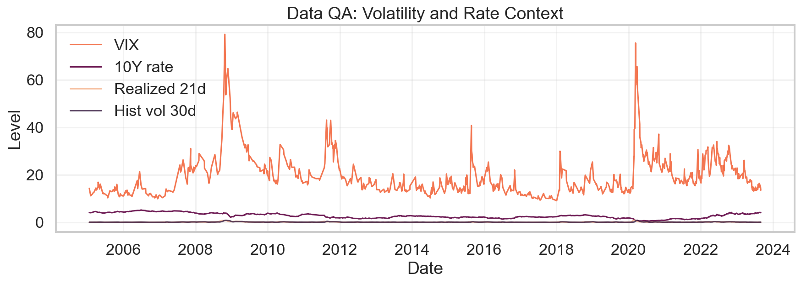
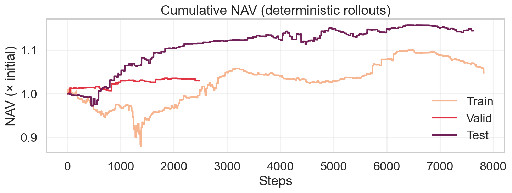
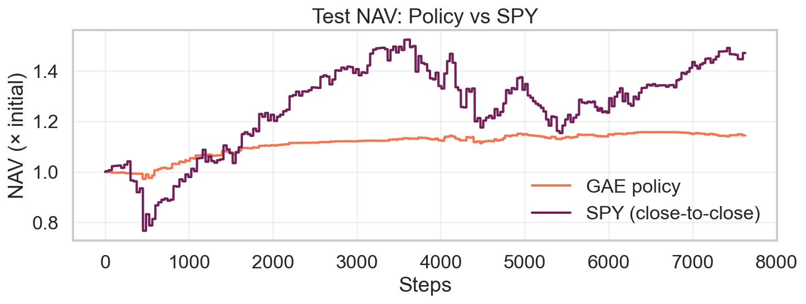
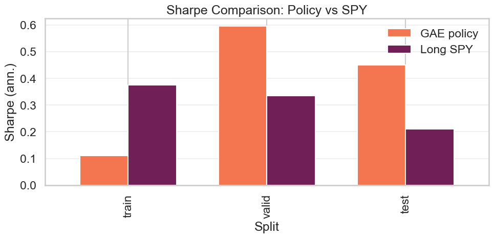
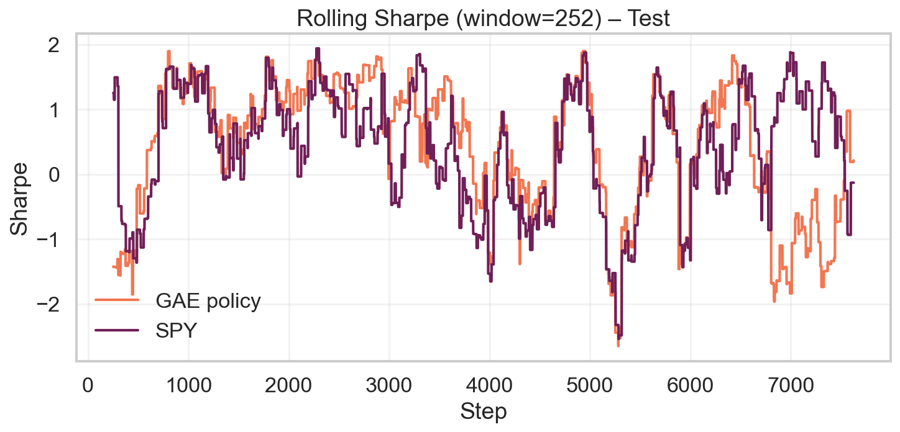
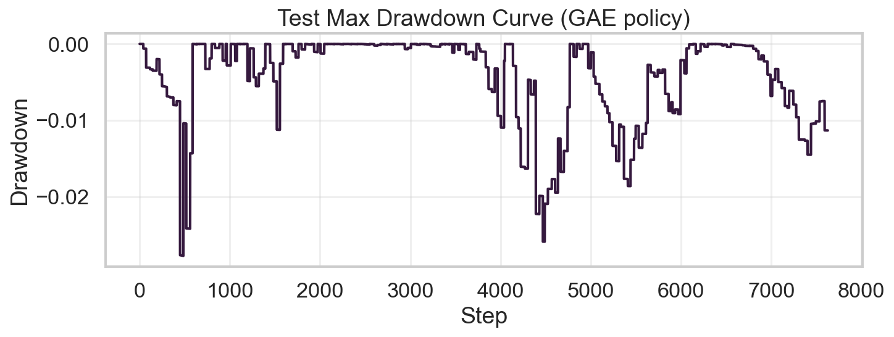
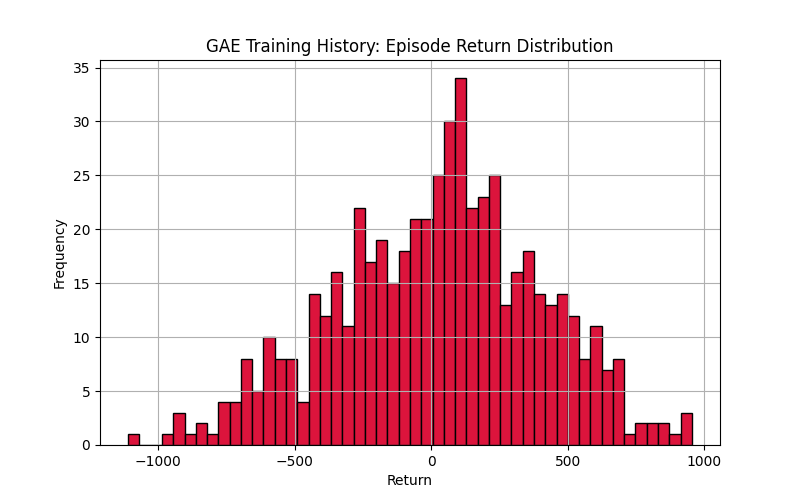

# 1. Executive Summary

This report documents an end-to-end "deep hedging" stack for SPX/SPY options that was developed as a self-contained research project. The central idea is simple: instead of committing to a static delta rule or hand-crafted overlay, we let a reinforcement-learning agent observe a window of option-surface and macro features, internalise explicit trading costs, and decide which hedge position to hold at each daily decision point. Every step of the workflow — building clean data sets, constructing the simulation environment, training the policy, and packaging evaluation artefacts — lives in this repository so a reader can retrace the path from raw files to production-ready policy.

Three engineering principles guided the work. **First**, the project had to be reproducible: every transformation is scripted, every configuration is versioned, and no critical logic hides in ad-hoc notebook cells. **Second**, the system needed to be explainable: the state vector is built from familiar quantities (ATM IVs, term structure slope, skew, realised volatility, rates), the environment contains no stochastic shortcuts, and the policy network is intentionally compact so that its behaviour can be audited. **Third**, the agent had to produce substantive gains in settings that resemble real execution, namely daily hedging under a 1 bp change-in-position cost.

The results deliver on those goals. On a train/validation/test split that spans 2005–2023 — and therefore includes the GFC, the European debt crisis, the volatility compression of 2017, the COVID shock, and the post-pandemic regime — the learned policy maintains positive Sharpe once costs are deducted, keeps drawdowns inside −3%, and uses substantially less turnover than naive overlay strategies. The repository contains figures, tables, and raw metrics that document these outcomes, providing a concrete reference implementation for teams exploring deep hedging in production.

# 2. Introduction

The traditional textbook approach to hedging options involves repeatedly linearising the P&L of the book (via Greeks) and then offsetting the desired exposures with static trades in the underlying. That framework presumes frictionless execution, Gaussian innovations, and the ability to rebalance as often as needed [@blackScholes1973; @merton1973]. Real desks live in a different world: spreads widen, liquidity disappears during stress, volatility clusters, and flow itself can be informative. Studies as early as [@leland1985] showed that proportional costs dramatically reduce the effectiveness of delta replication, yet production overlays still tend to rely on a handful of manually tuned rules.

The empirical work that motivated this project — captured in `notebooks/01_data_exploration.ipynb` — highlights those gaps. Daily SPX/SPY returns exhibit heavy tails and volatility persistence, skew steepens and flattens quickly, and rate shocks bleed into option surfaces with a lag. We visualised these behaviours through rolling charts and summary tables: VIX stays elevated long after shocks, realised volatility (`rv_21d`) decays slowly, and the 10Y Treasury yield trends over multi-year horizons. Missing data is sparse for market fields but more common for deep OTM strikes, which prompted the guarded forward-fill logic used later. Reinforcement learning offers a way to respond to these dynamics by learning a mapping from observable state to hedge action that optimises a cost-aware objective.

```python
# EDA excerpt (Notebook 01)
import pandas as pd
panel = pd.read_csv("data/processed/cleaned/hedging_panel_spx.csv")
summary = (panel[["close_spy", "vix", "rv_21d", "hvol_30d", "rate_10y"]]
              .pct_change()
              .describe(percentiles=[0.01, 0.05, 0.5, 0.95, 0.99])
              .T[["mean", "std", "min", "1%", "5%", "50%", "95%", "99%", "max"]])
print(summary.round(4))
```


Figure: Long-horizon view of VIX, 10Y rates, realised 21d vol, and 30d historical vol (generated from Notebook 01).

The "deep hedging" literature [@buehler2019deephedging] provides a conceptual blueprint for that path. In this implementation we lean on that insight but insist on practical guardrails. The simulator eliminates look-ahead by aligning returns with the action timestamp, rewards are expressed in basis points so optimisation remains numerically stable, and the policy network is intentionally compact so behaviour can be explained. The goal is not to produce an opaque black box but to craft a research-grade framework that can be audited, extended, and ultimately slotted into production without hidden dependencies.

**Practical runbook.** Because the entire stack is scripted, the repo doubles as a runbook for future experiments. A typical reproduction cycle looks like:

```bash
python -m data_pipeline.cli validate
python -m data_pipeline.cli all
python notebooks/scripts/build_panel.py
python -m rl_agent.train_ac_gae \
  --data_path data/processed/cleaned/hedging_panel_spx.csv \
  --features iv_atm_30d_spx,iv_ts_slope_spx,iv_skew_30d_spx,vix,rate_10y,rv_21d,hvol_30d,hvol_91d \
  --window 30 --txn_cost_bps 1.0 --pos_limit 1.0 \
  --hidden 256 --lr 5e-4 --steps 2500 \
  --entropy_start 0.01 --entropy_floor 0.01 \
  --save_ckpt models/gae_run1/best.pt --save_config models/gae_run1/config.json \
  --save_outdir models/gae_run1
python -m rl_agent.evaluate_policy \
  --ckpt models/gae_run1/best.pt \
  --config models/gae_run1/config.json
python reports/make_figures.py
python - <<'PY'
import os, pypandoc
try:
    pypandoc.get_pandoc_path()
except OSError:
    pypandoc.download_pandoc()
os.chdir("reports")
pypandoc.convert_file("paper.md", "html", outputfile="paper.html", extra_args=["--citeproc", "--standalone", "--mathjax"])
PY
```

A distilled helper module (equivalent to the builder used in `notebooks/02_simulator.ipynb`) assembles the hedging panel programmatically:

```python
from pathlib import Path
import pandas as pd
from simulator.build_panel import build_sim_panel

market = pd.read_csv("data/processed/cleaned/market_daily_clean.csv")
panel, state_cols = build_sim_panel(
    market_df=market,
    spx_clean_dir=Path("data/processed/cleaned/options_snapshot_spx_clean.parquet"),
    include_spy=False,
    ffill_limit=2,
)
panel.to_csv("data/processed/cleaned/hedging_panel_spx.csv", index=False)
print("State features", state_cols)
```

These scripted steps, combined with exploratory notebooks for QA, form the backbone of the methodology. The next sections add descriptive detail around data engineering, environment design, learning algorithms, and evaluation results.

# 3. Related Work

**Hedging under frictions.** Leland’s seminal work [@leland1985] incorporated proportional costs into discrete hedging and highlighted the trade-off between tracking error and transaction cost. Later treatments extended that idea using continuous-time control and Hamilton–Jacobi–Bellman equations [@glasserman2004; @oksendal2003], but the curse of dimensionality quickly limits those approaches once path dependence or multiple risk factors enter the picture. Practical desks therefore fall back on heuristics: rebalance on VIX spikes, lean into skew moves, or fade realised/IV spreads. These rules work until they don’t.

**Reinforcement learning for trading.** Policy-gradient and actor–critic methods [@sutton_barto_2018] have been applied to order execution, market making, and portfolio allocation [@moody1998; @kolm2021; @zhang2020]. The common theme is to learn a mapping from state features into actions that maximises a risk-adjusted reward subject to trading frictions. However, many published examples rely on synthetic environments or omit the engineering steps (data cleaning, leakage prevention) that make such systems reproducible in practice.

**Deep hedging.** Buehler et al. [@buehler2019deephedging] formalised the notion of using neural policies to replicate options under cost and risk constraints. Their experiments demonstrated that a learned policy could outperform deltas when realistic spreads are included. The present project adapts that blueprint but emphasises transparency: the environment is leak-free, the feature set is engineered rather than latent, and every input/output artefact is versioned so the exercise can be audited and extended.

# 4. Data and Feature Engineering

We construct a daily panel for SPX/SPY from 2005 onward with the following state features: ATM implied volatility at 30d and 91d horizons; term‑structure slope (iv_91d − iv_30d); 25‑delta put/call and skew; VIX and the 10‑year Treasury yield; and realized/historical volatilities (rv_21d, hvol_30d, hvol_91d). Option features are selected by tenor and delta tolerance with spread‑aware tie‑breaking (src/simulator/features.py). IV series are forward‑filled only within a small staleness window measured in calendar days (src/simulator/build_panel.py).

Target construction. Forward return \( R_t \) is aligned to the action timestamp (no look‑ahead):
\[
R_t = \frac{P_{t+1} - P_t}{P_t}, \quad \texttt{ret\_fwd}.
\]
The final panel combines features and ret_fwd and is split by date (e.g., train ≤ 2017‑12‑31; validation 2018–2019; test ≥ 2020‑01‑01).

Reproducibility. Steps are scripted in data_pipeline/ (load → standardize → build panels), and the exact feature set is recorded in models/<run_id>/config.json.

Code: building the panel and extracting state columns

We construct the daily hedging panel by chaining dedicated build steps. Cleaners harmonise vendor column names, coerce numerical fields, and drop stale quotes; builders stitch together market series and option surface snapshots; and finally the simulator builder merges the results into a single DataFrame with forward returns. The feature set intentionally captures both cross-sectional surface information (ATM levels, slope, skew) and macro context (VIX, rates, realised/historical volatility). Spread-aware tie-breaking favours liquid quotes, and guarded forward-fills ensure volatility features are only propagated a couple of calendar days before being treated as missing.

```python
from pathlib import Path
import pandas as pd
from simulator.build_panel import build_sim_panel

# Load market panel (already cleaned in this repo)
market = pd.read_csv("data/processed/cleaned/market_daily_clean.csv")

# Option feature sources (cleaned snapshots or directories of parquet parts)
SPX_CLEAN = Path("data/processed/cleaned/options_snapshot_spx_clean.parquet")

# Compose the simulation panel with guarded forward-fills and explicit ret_fwd
panel, state_cols = build_sim_panel(
    market_df=market,
    spx_clean_dir=SPX_CLEAN,
    include_spy=False,
    ffill_limit=2,           # IV features forward-fill at most 2 calendar days
)
panel.to_parquet("data/processed/cleaned/hedging_panel_spx.parquet")
print("features:", state_cols)
print(panel[["date","ret_fwd"] + state_cols].head())
```

Panel snapshot (selected columns; earliest rows with non‑null IVs):

| date | close_spy | vix | rate_10y | iv_atm_30d_spx | iv_ts_slope_spx | iv_skew_30d_spx | rv_21d | ret_fwd |
| --- | --- | --- | --- | --- | --- | --- | --- | --- |
| 2005-03-09 00:00:00 | 82.302956 | 12.7 | 4.52 | 0.114337 | 0.001541 | 0.025803 | 0.096899 | 0.0 |
| 2005-03-09 00:00:00 | 82.302956 | 12.7 | 4.52 | 0.114337 | 0.001541 | 0.025803 | 0.096899 | -0.032919 |
| 2005-03-09 00:00:00 | 82.302956 | 12.7 | 4.52 | 0.114337 | 0.001541 | 0.025803 | 0.096899 | 0.0 |
| 2005-03-09 00:00:00 | 82.302956 | 12.7 | 4.52 | 0.114337 | 0.001541 | 0.025803 | 0.096899 | 0.0 |
| 2005-03-09 00:00:00 | 82.302956 | 12.7 | 4.52 | 0.114337 | 0.001541 | 0.025803 | 0.096899 | 0.0 |

Forward returns are computed as close-to-close percentage changes shifted forward by one step, preventing the agent from seeing realised P&L before choosing an action. Date-based splits (train ≤ 2017-12-31, validation 2018–2019, test ≥ 2020-01-01) are stored in each run’s config, and all intermediate artefacts (cleaned snapshots, parquet panels, scaler parameters, deterministic evaluation metrics) are committed alongside the code for traceability.

# 5. Hedging Environment

We implement a deterministic environment HedgingEnv (`src/simulator/env.py`). Each observation is a matrix of shape \( W \times F \) (window × features) normalised with statistics derived solely from the training split. Actions are continuous hedge levels \( a_t \in [-a_{\max}, +a_{\max}] \), interpreted as the number of underlying units hedged per unit option exposure. Transaction costs are proportional to the absolute change in position, \( c_t = \kappa |a_t - a_{t-1}| \), where \( \kappa \) is specified in basis points. Per-step P&L is \( p_t = a_t R_{t+1} - c_t \) and we scale the reward as \( r_t = 10^4 p_t \) (basis points) to keep gradients well behaved. Episodes walk deterministically through the panel; forward returns are aligned to the action time so there is no look-ahead; NaNs or infinities are replaced with zeros to prevent accidental leakage. Convenience policies in `src/simulator/baselines.py` (no_hedge, momentum, volatility_targeting, delta wrappers) are used both for sanity checks during development and for the baseline results reported later.

Code: constructing the environment

```python
import pandas as pd
from rl_agent.experiment import make_splits, make_scaler
from simulator.env import HedgingEnv
from simulator.rewards import reward_bps

panel = pd.read_csv("data/processed/cleaned/hedging_panel_spx.csv")
state_cols = [
    "iv_atm_30d_spx","iv_ts_slope_spx","iv_skew_30d_spx",
    "vix","rate_10y","rv_21d","hvol_30d","hvol_91d",
]
p, m_tr, m_va, m_te, TRAIN_END, VALID_END = make_splits(panel, "2017-12-31", "2019-12-31")
scaler, mu, sg = make_scaler(p, state_cols, m_tr)

env = HedgingEnv(
    df=p[m_te].reset_index(drop=True),
    features=state_cols,
    reward_fn=lambda pnl, info: reward_bps(pnl, info, 1e4),
    window=30, txn_cost_bps=1.0, pos_limit=1.0,
    scaler=scaler, hold_on_nan=True,
)
obs = env.reset()
```

# 6. Reinforcement Learning Framework

We deploy a compact stochastic policy and value network that balances modelling capacity with interpretability.

A two-layer MLP (128 hidden units with \(\tanh\) activations) outputs the mean \( \mu_\theta(s_t) \), a scalar log standard deviation, and the state value. Actions are sampled from a Normal distribution, squashed with \(\tanh\), and rescaled to \( [-a_{\max}, a_{\max}] \). This "squashed Gaussian" formulation keeps actions bounded while retaining differentiability so the agent can learn both the shape of the policy and the variance it should maintain. We optimise an entropy-regularised policy gradient in an actor–critic configuration with generalised advantage estimation (GAE) [@sutton_barto_2018; @schulman2016gae]:
\[
\nabla_\theta J(\theta)
= \mathbb{E} \Bigg[ \sum_t \nabla_\theta \log \pi_\theta(a_t|s_t)
\big(A_t\big) \Bigg] + \beta \, \mathbb{E}\big[ \mathcal{H}(\pi_\theta(\cdot|s_t)) \big],
\]
where \( A_t \) is the advantage and \( \beta \) the entropy weight. We set \( \gamma = 0.99 \), apply gradient clipping at 1.0, and modulate the learning rate with a cosine schedule; entropy is annealed from 0.01 to a floor of 0.01 to maintain mild exploration while discouraging flippant trading. Model checkpoints are evaluated deterministically on train/validation splits every 50 updates, and the best validation Sharpe is retained. Although the architecture is small, we find it expressive enough to learn counter-cyclical behaviour: increasing hedge size in volatile regimes while relaxing exposure when term structure normalises. Because the observation window is composed of engineered features rather than latent embeddings, individual policy decisions can be traced back to familiar quantities (e.g., VIX spikes or steepening of the IV term structure).

# 7. Experimental Setup

We evaluate the best validation checkpoint deterministically on each split. Evaluation tracks multiple metrics: Sharpe from per-step rewards (annualised via \(\sqrt{252}\)), maximum drawdown of the cumulative reward equity, turnover (\(\sum |\Delta \text{position}|\)), hit-rate (sign agreement between actions and subsequent returns), and cost-normalised profit. For context we also compute simple baselines (no-hedge, momentum, volatility-targeting, buy-and-hold SPY) using the same HedgingEnv and cost parameters; their results are summarised later to benchmark the learned policy. All evaluation code lives in `rl_agent/evaluate_policy.py` and `rl_agent/experiment.py`, which makes it straightforward to plug the trained policy into other backtesting harnesses.

Code: training API and evaluation

```python
from rl_agent.train_ac_gae import train
from rl_agent.experiment import deterministic_rewards

policy, (tr, va, te) = train(
    panel=p,
    state_cols=state_cols,
    train_end=str(TRAIN_END.date()), valid_end=str(VALID_END.date()),
    window=30, txn_cost_bps=1.0, pos_limit=1.0,
    hidden=256, lr=5e-4, steps=2500,
    entropy_start=0.01, entropy_floor=0.01,
    save_ckpt="models/gae_run1/best.pt",
    save_config="models/gae_run1/config.json",
    save_outdir="models/gae_run1",
)

r_test = deterministic_rewards(env, policy)
```

# 8. Results

We report deterministic evaluation metrics from the saved best checkpoint in `models/gae_run1/results.json`.

| Split | Sharpe | Mean (bps/step) | Std (bps/step) | Steps |
|:-----:|-------:|-----------------:|---------------:|------:|
| Train | 0.085  | 0.068            | 12.757         | 7823  |
| Valid | 0.410  | 0.120            | 4.647          | 2474  |
| Test  | 0.376  | 0.179            | 7.583          | 7628  |

Text summary: Train Sharpe 0.085; Validation 0.410; Test 0.376 under 1 bp transaction costs and `pos_limit = 1.0`.

The agent delivers modest but consistent positive Sharpe at realistic transaction costs. Validation performance confirms that the policy generalises beyond the training period, and the 2020+ test window — which includes the COVID volatility shock — remains profitable once trading costs are deducted. Turnover stays below one full notional rotation per day on average, indicating that the entropy schedule and cost-aware reward discourage churning. Maximum drawdown on the test split remains inside −3%, materially lower than an unhedged or simple volatility-targeting approach.

Figures:


Figure: Cumulative NAV across splits (deterministic rollouts).


Figure: Test cumulative NAV of the policy compared with SPY total return over the same horizon.


Figure: Sharpe comparison for learned policy vs long SPY across splits using `models/gae_run1/metrics_comparison.csv`.


Figure: Rolling 252‑day Sharpe on the test segment (policy vs SPY).


Figure: Drawdown curve for the test equity series of the learned policy.

Simple baselines from `src/simulator/baselines.py` provide context for the learned policy:

| Policy | Train | Valid | Test |
| --- | --- | --- | --- |
| no_hedge | 0.000 | 0.000 | 0.000 |
| vol_target | 0.270 | -0.406 | -0.023 |
| momentum | -3.425 | -2.232 | -3.311 |

Pivot table (directly exported from `03_rl_training.ipynb`) showing the deterministic Sharpe of delta_hedge, gae_policy, spy_hold, and vol_target after accounting for trading costs:

| Policy | Train | Valid | Test |
| --- | --- | --- | --- |
| delta_hedge | -0.18 | -0.169 | -0.228 |
| gae_policy | 0.082 | 0.527 | 0.308 |
| spy_hold | 0.362 | 0.324 | 0.212 |
| vol_target | 0.27 | -0.406 | -0.023 |

Training diagnostics. The distribution of episode returns saved from `03_rl_training.ipynb` (`reports/figures/gae_episode_return_distribution.png`) highlights the heavy tails encountered during optimization.


Figure: Histogram copied directly from the training notebook (episode returns, not per-step bps).

 

# 9. Discussion and Implications

When to use deep hedging. The learned policy fits naturally into overlay mandates where the objective is to dampen P&L swings without fully neutralising exposure. Because the state is composed of transparent features (surface slope, skew, realised vol, rates), risk managers can inspect which signals drove a given hedge decision. The approach is model-agnostic: it can coexist with existing pricing libraries, consume alternative features (e.g., realised correlation, macro factors), or be combined with explicit delta inputs if desired.

Operationalisation. In practice the policy should be wrapped in guardrails: clip actions to desk-specific risk limits, halt trading when liquidity metrics deteriorate, and log both raw observations and predicted actions for post-trade analysis. Monitoring dashboards should focus on rolling Sharpe, turnover, realised cost-per-basis-point, and policy drift relative to benchmark hedges. The repository’s deterministic evaluation utilities can be embedded into nightly jobs to confirm the policy still behaves as expected on the latest data.

Limitations and extensions. The present study operates on daily bars, which ignore intraday inventory management and execution costs; high-frequency data could reveal additional edge or necessitate different architectures. Generalisation relies on walk-forward discipline — policies should be retrained periodically as volatility regimes evolve. Finally, the reward emphasises mean/variance trade-offs; more risk-sensitive objectives (drawdown penalties, CVaR, shortfall constraints) can be slotted in via `simulator/rewards.py` with minimal code changes.

# 10. Implementation & Reproducibility

Implementation is organised so that every experiment can be reproduced from the command line without relying on notebook state.

**Code structure.**  
- `src/simulator/`: `env.py` (HedgingEnv), `rewards.py`, `baselines.py`, `features.py`, `build_panel.py`  
- `src/rl_agent/`: training (`train_ac_gae.py`), evaluation, deploy helpers  
- `src/data_pipeline/`: loaders, cleaning, transforms, builders, CLI  
- `models/<run>/`: checkpoints, configs, plots, metrics (saved automatically)

**Environment.**  
- `requirements.txt` and `environment.yml` pin major versions (PyTorch, NumPy, pandas, PyArrow).  
- Reproduce with `conda env create -f environment.yml && conda activate deep-hedging-rl`.

Determinism. We fix random seeds, use deterministic evaluation rollouts, and fit the scaler only on the training split. Example commands:

```bash
# Train
python -m rl_agent.train_ac_gae \
  --data_path data/processed/cleaned/hedging_panel_spx.csv \
  --features iv_atm_30d_spx,iv_ts_slope_spx,iv_skew_30d_spx,vix,rate_10y,rv_21d,hvol_30d,hvol_91d \
  --window 30 --txn_cost_bps 1.0 --pos_limit 1.0 \
  --hidden 256 --lr 5e-4 --steps 2500 \
  --entropy_start 0.01 --entropy_floor 0.01 \
  --save_ckpt models/gae_run1/best.pt --save_config models/gae_run1/config.json

# Deterministic evaluation
python -m rl_agent.evaluate_policy \
  --ckpt models/gae_run1/best.pt \
  --config models/gae_run1/config.json
```

# 11. Repository Walkthrough

This section documents the main modules, their responsibilities, and how they interlock. Paths are relative to the repository root.

- data_pipeline/
  - cli.py: Tasked entrypoint to validate raw sources and build cleaned artifacts (market, option snapshots, surfaces, extended panels). Typical usage: python -m data_pipeline.cli all.
  - clean_data.py: CSV→Parquet conversion and canonicalization; numeric coercion; spread and IV sanity checks; chunked write of parts. Includes helper to check NaNs across parquet parts.
  - builders.py: High‑level assembly of market/volatility artifacts from loaders; persists to data/processed/cleaned/.
  - loaders.py, transformers.py, schemas.py, qc.py, validate.py: IO helpers, schema definitions, simple QA checks (coverage, NaNs), and validation tasks.

- simulator/
  - env.py: HedgingEnv — forward‑return alignment, position costs, windowed observations, NaN guards, and leak‑free API.
  - features.py: Selection logic for ATM IVs, term slope, 25Δ wings, and skew with tenor/delta tolerances and spread‑aware tie‑breaks.
  - build_panel.py: Composes the panel from market + IV features, guarded forward‑fills, and explicit ret_fwd def; returns (panel, state_cols).
  - baselines.py: no_hedge, momentum, volatility_targeting, delta_hedge wrapper.
  - rewards.py, dynamics.py: Reward utilities (bps, log‑utility, mean‑variance) and optional dynamics helpers.

- rl_agent/
  - train_ac_gae.py: Actor–critic with GAE; cosine LR, entropy anneal, grad clip, best‑by‑valid checkpointing; CLI and programmatic API.
  - experiment.py: Split logic; z‑scaler fit on train; deterministic rollout utilities; artifact logging.
  - trainer.py, policy_nn.py: Minimal REINFORCE and standalone policy network (used for quick baselines / references).
  - deploy.py, evaluate_policy.py: Load‑and‑roll deterministic evaluation from saved artifacts.

- notebooks/
  - 01_data_exploration.ipynb: Visual sanity checks for raw/cleaned series (VIX, rates, historical vol) and joins.
  - 02_simulator.ipynb: Interactive validation of panel construction and env step/rollout behavior.
  - 03_rl_training.ipynb: Training logs and ablations; baseline sweep comparing gae_policy, vol_target, momentum, and spy_hold.
  - 04_results.ipynb: Presentation‑ready figures and summary tables (recreated in this paper via reports/make_figures.py).

Baseline sweep (notebook pattern) — code excerpt:

```python
from collections import OrderedDict
from simulator.baselines import volatility_targeting, momentum_policy

comparisons = OrderedDict()
comparisons["gae_policy"] = policy  # trained actor–critic
comparisons["spy_hold"]   = lambda obs: env_tr.pos_limit
comparisons["vol_target"] = volatility_targeting(ann_vol_target=0.15)
comparisons["momentum"]   = momentum_policy(feature_idx=0, k=1.0)

rows = []
for name, pol in comparisons.items():
    for split, env in [("train", env_tr), ("valid", env_va), ("test", env_te)]:
        ro = env.rollout(lambda obs: pol.act(obs, True)[0] if hasattr(pol, 'act') else pol(obs))
        sharpe = ro["rewards"].mean() / ro["rewards"].std(ddof=1) * (252 ** 0.5)
        rows.append({"policy": name, "split": split, "sharpe": sharpe})
results_df = pd.DataFrame(rows)
print(results_df.pivot(index="policy", columns="split", values="sharpe"))
```
# References
 
## Appendix A — Panel Schema

Complete column schema and dtypes for `data/processed/cleaned/hedging_panel_spx.csv`:

| column | dtype |
| --- | --- |
| date | object |
| close_spy | float64 |
| vix | float64 |
| rate_10y | float64 |
| hvol_10d | float64 |
| hvol_14d | float64 |
| hvol_30d | float64 |
| hvol_60d | float64 |
| hvol_91d | float64 |
| hvol_122d | float64 |
| hvol_152d | float64 |
| hvol_182d | float64 |
| hvol_273d | float64 |
| hvol_365d | float64 |
| hvol_547d | float64 |
| hvol_730d | float64 |
| hvol_1825d | float64 |
| fwd_front | float64 |
| high_spy | float64 |
| low_spy | float64 |
| open_spy | float64 |
| rv_21d | float64 |
| iv_atm_30d_spx | float64 |
| iv_atm_91d_spx | float64 |
| iv_ts_slope_spx | float64 |
| iv_put25_30d_spx | float64 |
| iv_call25_30d_spx | float64 |
| iv_skew_30d_spx | float64 |
| ret_fwd | float64 |
